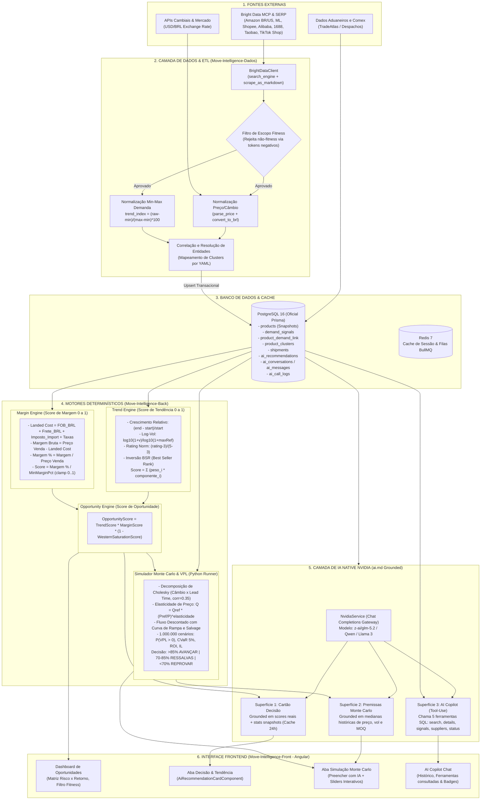

# Move Intelligence — Especificação Técnica Unificada e Arquitetura do Sistema

> **Versão:** 2.0 (Unificada)  
> **Escopo:** Plataforma Completa (`Move-Intelligence-Dados`, `Move-Intelligence-Back`, `Move-Intelligence-Front`, Camada de IA NVIDIA e Motores Matemáticos)

---

## 1. Visão Geral e Arquitetura do Sistema

O **Move Intelligence** é uma plataforma de inteligência de mercado orientada ao setor de equipamentos e acessórios fitness. A arquitetura conecta ingestão de dados em tempo real e em lote, normalização e resolução de entidades, motores matemáticos determinísticos de scoring e simulação estocástica (Monte Carlo), culminando em uma camada de IA (*grounded*) conectada a um frontend analítico em Angular.



---

## 2. Motores Matemáticos e Fórmulas de Cálculo

Nenhum número de score, oportunidade ou risco é alucinado por LLM. Todos os cálculos derivam de motores matemáticos determinísticos:

### 2.1 Camada de Dados & Normalização (`Move-Intelligence-Dados`)

1. **Normalização de Sinal de Demanda (Min-Max por Geo e Fonte)**:
   $$\text{trend\_index} = \frac{\text{raw\_value} - \min(\text{raw\_value})}{\max(\text{raw\_value}) - \min(\text{raw\_value})} \times 100$$
   *O valor bruto (`raw_value`) é sempre preservado para auditoria.*

2. **Conversão Cambial de Preço**:
   $$\text{Preço}_{\text{BRL}} = \text{Preço}_{\text{Origem}} \times \text{Taxa}(\text{Moeda} \to \text{BRL})$$

3. **Filtro de Escopo Fitness**:
   - Avaliação rigorosa do título contra lista de tokens negativos (`NON_FITNESS_TITLE_TOKENS`), descartando contaminações de catálogo (ex.: eletrônicos, vestuário casual, fones de ouvido, livros) antes de qualquer persistência.

---

### 2.2 Trend Engine (`TrendEngineService`)

O score de tendência varia de $0.0$ a $1.0$ e é composto por:

1. **Normalização Logarítmica de Reviews**:
   $$\text{ReviewScore} = \text{clamp}\left(\frac{\log_{10}(1 + \text{reviewCount})}{\log_{10}(1 + \text{maxReference})}\right)$$
   *A escala logarítmica impede o achatamento de produtos com poucas dezenas de avaliações.*

2. **Normalização de Avaliação (Rating)**:
   $$\text{RatingScore} = \text{clamp}\left(\frac{\text{rating} - 3.0}{5.0 - 3.0}\right)$$
   *Avaliações $\le 3.0$ pontuam $0.0$, pois são consideradas sinal negativo de mercado.*

3. **Crescimento Relativo Temporal**:
   $$\text{Growth} = \frac{\text{valor}_{\text{recente}} - \text{valor}_{\text{antigo}}}{\max(|\text{valor}_{\text{antigo}}|, 1)}$$
   *Para `best_seller_rank`, o sinal é invertido (queda de rank de 5000 para 500 = melhora).*

4. **Composição Ponderada do Trend Score**:
   $$\text{TrendScore} = \sum_{i} w_i \times \text{Componente}_i$$
   Onde os pesos $w_i$ padrão configurados são:
   - `searchGrowth` (Crescimento de Buscas): $0.25$
   - `marketplaceGrowth` (Crescimento em Marketplaces): $0.25$
   - `supplierGrowth` (Fornecedores Ativos): $0.15$
   - `priceOpportunity` (Oportunidade de Preço): $0.15$
   - `reviewVelocity` (Velocidade de Reviews): $0.15$
   - `socialBuzz` (TikTok / Redes Sociais): $0.05$

---

### 2.3 Margin Engine (`MarginEngineService`)

Calcula o custo total de importação e comercialização nacional (*Landed Cost*):

1. **Custo de Origem (FOB em BRL)**:
   $$\text{Custo FOB}_{\text{BRL}} = (\text{Preço Fornecedor} + \text{Frete Interno} + \text{Taxa Agente}) \times \text{Câmbio}$$

2. **Base de Cálculo e Tributação**:
   $$\text{Base Tributável} = \text{Custo FOB}_{\text{BRL}} + (\text{Frete Internacional} \times \text{Câmbio})$$
   $$\text{Impostos de Importação} = \text{Base Tributável} \times \text{Alíquota Importação}$$
   $$\text{Taxas Operacionais} = \text{Preço Venda Estimado} \times \text{Alíquota Operacional}$$

3. **Landed Cost Final**:
   $$\text{Landed Cost} = \text{Base Tributável} + \text{Impostos} + \text{Taxas Operacionais}$$

4. **Margem Líquida e Margin Score**:
   $$\text{Margem Líquida} = \text{Preço Venda Estimado} - \text{Landed Cost}$$
   $$\text{Margem \%} = \frac{\text{Margem Líquida}}{\text{Preço Venda Estimado}}$$
   $$\text{MarginScore} = \text{clamp}\left(\frac{\text{Margem \%}}{\text{Margem Mínima Aceitável}}\right)$$

---

### 2.4 Opportunity Engine (`OpportunityEngineService`)

Consolida a atratividade comercial do produto:
$$\text{OpportunityScore} = \text{TrendScore} \times \text{MarginScore} \times (1 - \text{WesternSaturationScore})$$

---

### 2.5 Simulador Estocástico Monte Carlo & VPL (`monte-carlo-vpl.py`)

Executa até **1.000.000 de cenários simulados** com vetorização em NumPy:

1. **Choques Correlacionados (Fatoração de Cholesky)**:
   Modela a correlação empírica entre Choque Cambial e Atraso de *Lead Time* ($\rho = 0.35$):
   $$L = \text{Cholesky}\begin{pmatrix} 1 & \rho \\ \rho & 1 \end{pmatrix}, \quad \begin{pmatrix} z_{\text{câmbio}} \\ z_{\text{lead}} \end{pmatrix} = L \begin{pmatrix} \mathcal{N}(0,1) \\ \mathcal{N}(0,1) \end{pmatrix}$$

2. **Curva de Elasticidade-Preço da Demanda**:
   $$\text{Demanda Esperada} = \text{Demanda}_{\text{ref}} \times \left(\frac{\text{Preço}_{\text{ref}}}{\text{Preço Venda}}\right)^{\text{elasticidade}}$$

3. **Dimensionamento de Lote e Investimento Inicial**:
   $$\text{Qtd Comprada} = \text{Demanda Planejada} \times (1 + \text{Folga Estoque})$$
   $$\text{Investimento Inicial} = \text{Qtd Comprada} \times \text{Landed Cost} + \text{Marketing Inicial}$$

4. **Fluxo de Caixa Descontado (VPL)**:
   $$\text{VPL} = -\text{Investimento Inicial} + \sum_{t=1}^{H} \frac{\text{Vendas Lojas}_t \times \text{Receita Líquida}_t}{(1 + \text{TMA})^t} - \text{VP}(\text{Custos Fixos}) + \text{VP}(\text{Valor Residual Estoque})$$

5. **Métricas de Cauda e Régua de Decisão**:
   - $CVaR_{5\%}$: Média dos 5% piores cenários de VPL.
   - $P(\text{VPL} > 0)$: Probabilidade de lucro positivo.
   - **Régua de Decisão**:
     - $P(\text{VPL} > 0) > 85\% \implies \text{Risco Baixo} \to \textbf{AVANÇAR}$
     - $70\% < P(\text{VPL} > 0) \le 85\% \implies \text{Risco Médio} \to \textbf{AVANÇAR COM RESSALVAS}$
     - $P(\text{VPL} > 0) \le 70\% \implies \text{Risco Alto} \to \textbf{REPROVAR}$

---

## 3. A Camada de IA (NVIDIA Gateway & Grounding)

A camada de inteligência artificial (`NvidiaService`) opera com modelo base `z-ai/glm-5.2` (ou Qwen / Llama 3) sob o princípio de **Grounding Estrito**:

### 3.1 As 3 Superfícies de IA

| Superfície | Localização no Código | Grounding no Banco | Função no Negócio |
|---|---|---|---|
| **1. Cartão de Decisão** | `GET /products/:id/ai-recommendation` | `OpportunityScore`, `TrendScore`, estatísticas `min/max/avg` dos snapshots e alertas reais | Gera parecer executivo explicando por que o produto deve ou não ser importado (Cache 24h). |
| **2. Premissas Monte Carlo** | `POST /products/:id/monte-carlo/ai-premises` | Medianas reais observadas nos snapshots (`price_median`, `volume_median`, `moq_median`) | Preenche premissas financeiras coerentes com o histórico real para validação *Human-in-the-Loop*. |
| **3. AI Copilot (Chat)** | `POST /copilot/chat` | 5 Ferramentas SQL tipadas via Prisma | Executa loop de *Tool-Use* consultando produtos, detalhes de risco, embarques aduaneiros e status de coletas. |

### 3.2 Ferramentas Tipadas do AI Copilot (`Tool-Use`)
1. `search_products`: Pesquisa clusters fitness por nome/categoria e retorna scores determinísticos.
2. `get_product_details`: Retorna histórico de preços, fornecedores associados e risco Monte Carlo.
3. `get_market_signals`: Consulta tendências de demanda e registros aduaneiros (TradeAtlas).
4. `get_top_suppliers`: Retorna os principais exportadores internacionais mapeados.
5. `get_collection_status`: Retorna o andamento das coletas ativas.

---

## 4. Guia Operacional de Execução (ETL e Scrapers)

### 4.1 Coleta em Tempo Real (Live Intelligence)
Executa a raspagem via Bright Data MCP, normaliza no escopo fitness e grava no PostgreSQL:

```bash
# Execução direta com o ambiente virtual
PYTHONPATH=. python3 main.py --pipeline live-intelligence --term "haltere ajustável" --sources amazon_br,mercado_livre --limit 5 --geos BR
```

### 4.2 Varredura Semanal de Catálogo (Weekly Intelligence)
Percorre todos os clusters configurados em `config/keyword_map.yaml`:

```bash
PYTHONPATH=. python3 main.py --pipeline weekly-intelligence --clusters dumbbells,kettlebells --sources amazon_br,mercado_livre,shopee_br --limit 10 --geos BR
```

### 4.3 Execução em Modo Simulação (Dry-Run)
Adicione a flag `--dry-run` para testar scrapers e normalização sem persistir no banco:

```bash
PYTHONPATH=. python3 main.py --pipeline live-intelligence --term "kettlebell ferro fundido" --sources amazon_br --limit 3 --dry-run
```

---

## 5. Estrutura do Banco de Dados (Prisma / PostgreSQL)

- `products`: Armazena snapshots de anúncios de marketplaces (`source`, `record_id`, `price_value`, `rating`, `reviews_count`, `moq`).
- `demand_signals`: Séries temporais normalizadas de busca (`keyword`, `geo`, `source`, `trend_index`).
- `product_demand_link`: Vínculos de correlação entre produtos e sinais de busca.
- `product_clusters`: Agrupamento canônico de produtos para cálculo de scores e ranking.
- `shipments`: Registros alfandegários de importação de produtos fitness.
- `ai_recommendations`: Cache de decisões geradas pela IA.
- `ai_conversations` / `ai_messages`: Histórico de conversas do AI Copilot.
- `ai_call_logs`: Telemetria de consumo de tokens, latência e status de chamadas de IA.
