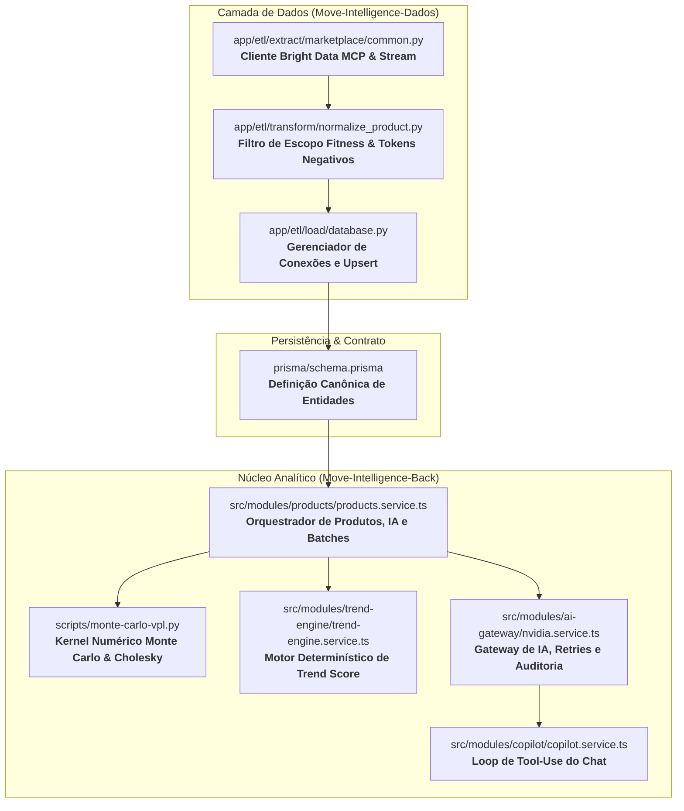
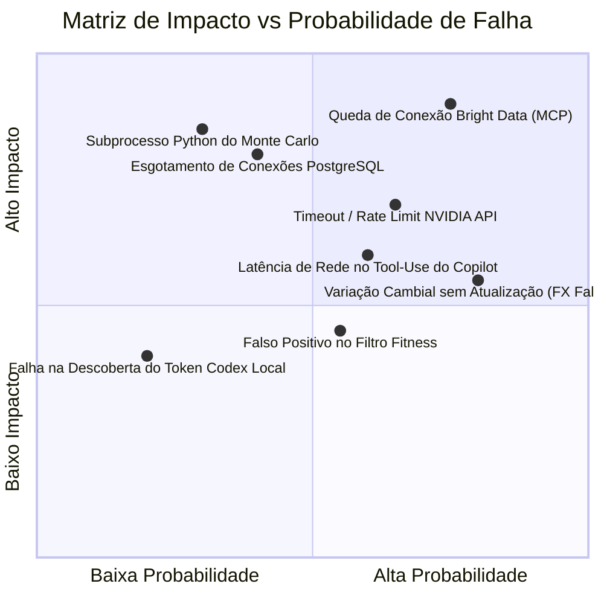

# Relatório de Pontos Críticos, Arquivos Vitais e Análise de Falhas (SPOF)

> **Projeto:** Move Intelligence (Front, Back, Dados e IA)  
> **Classificação:** Documento Técnico de Arquitetura, Riscos e Resiliência

---

## 1. Mapeamento dos Arquivos e Módulos Mais Críticos

A estabilidade e o valor de negócio do Move Intelligence dependem diretamente dos seguintes arquivos essenciais:

### Detalhamento dos Arquivos Críticos

| Arquivo / Caminho | Função Crítica | Impacto de Falha |
|---|---|---|
| [`Move-Intelligence-Dados/app/etl/extract/marketplace/common.py`](file:///home/schinor/Projetos/Move/Move-Intelligence-Dados/app/etl/extract/marketplace/common.py) | Gerencia a sessão HTTP streamable do **Bright Data MCP**, decodificação JSON-RPC e controle de concorrência. | **Interrupção total** da coleta em tempo real e semanal de marketplaces internacionais e nacionais. |
| [`Move-Intelligence-Dados/app/etl/transform/normalize_product.py`](file:///home/schinor/Projetos/Move/Move-Intelligence-Dados/app/etl/transform/normalize_product.py) | Implementa o guardrail de escopo fitness (`is_fitness_product`) e lista de tokens de exclusão (`NON_FITNESS_TITLE_TOKENS`). | **Contaminação de catálogo**: produtos irrelevantes (roupas casuais, eletrônicos) distorcem as métricas de margem e oportunidade. |
| [`Move-Intelligence-Dados/app/etl/load/database.py`](file:///home/schinor/Projetos/Move/Move-Intelligence-Dados/app/etl/load/database.py) | Pool de conexões SQLAlchemy, sanitização de DSN e persistência transacional. | **Falha de gravação ou esgotamento de conexões** no PostgreSQL. |
| [`Move-Intelligence-Back/scripts/monte-carlo-vpl.py`](file:///home/schinor/Projetos/Move/Move-Intelligence-Back/scripts/monte-carlo-vpl.py) | Executa 1.000.000 de iterações vetoriais com NumPy, decomposição de Cholesky e cálculo de $CVaR_{5\%}$ e $P(\text{VPL} > 0)$. | **Inviabilidade do cálculo de risco financeiro** e travamento do ranking na aba de oportunidades. |
| [`Move-Intelligence-Back/src/modules/products/products.service.ts`](file:///home/schinor/Projetos/Move/Move-Intelligence-Back/src/modules/products/products.service.ts) | Orquestra a simulação em lote, agregação estatística dos snapshots e cache das decisões de IA. | **Degradação das abas Decisão e Simulação** no frontend. |
| [`Move-Intelligence-Back/src/modules/ai-gateway/nvidia.service.ts`](file:///home/schinor/Projetos/Move/Move-Intelligence-Back/src/modules/ai-gateway/nvidia.service.ts) | Gateway resiliente com timeout (35s), retentativa exponencial e telemetria (`ai_call_logs`). | **Erros 503 no Copilot e Cartão de IA** em caso de indisponibilidade da NVIDIA. |
| [`Move-Intelligence-Back/src/modules/copilot/copilot.service.ts`](file:///home/schinor/Projetos/Move/Move-Intelligence-Back/src/modules/copilot/copilot.service.ts) | Executa até 3 iterações de *Tool-Use* contra 5 funções SQL tipadas via Prisma. | **Alucinações ou timeout no chat** se as ferramentas falharem ou entrarem em loop. |

---

## 2. Matriz de Pontos de Falha (SPOF) e Riscos do Sistema

### 2.1 Análise Detalhada dos Pontos de Falha e Mitigações

#### 🔴 1. Conectividade e Streaming do Bright Data MCP
- **Mecanismo de Falha**: O protocolo MCP sobre HTTP Streaming (`text/event-stream`) pode sofrer *hang* (permanecer aberto indefinidamente) ou sofrer corte de conexão por proxy/firewall intermediário.
- **Risco**: Travar o worker de extração consumindo a thread do pool de coleta.
- **Mitigação Atual**: Timeout explícito de requisição e parsing linha a linha até o primeiro JSON-RPC com fechamento garantido no bloco `finally`.
- **Recomendação**: Adicionar *circuit breaker* com fallback automático para SERP direta caso o endpoint MCP permaneça inacessível por mais de 3 requisições consecutivas.

#### 🔴 2. Execução de Subprocesso Python no Backend NestJS (`monte-carlo-vpl.py`)
- **Mecanismo de Falha**: O NestJS invoca o script Python via `child_process.spawn`. Se o interpretador Python do sistema não tiver o NumPy instalado ou se o ambiente virtual `.venv` estiver ausente, a chamada falha silenciosamente ou lança exceção 500.
- **Risco**: Inviabilizar o cálculo de risco de todos os clusters do catálogo.
- **Mitigação Atual**: O backend isola as falhas por cluster (`try/catch` individual no `simulateBatchForRanking`), permitindo que a falha de um produto não aborte o ranking dos demais.
- **Recomendação**: Criar um endpoint de Health Check no NestJS (`/health/monte-carlo`) que executa um teste sintético do script na inicialização do servidor.

#### 🟡 3. Esgotamento do Pool de Conexões PostgreSQL
- **Mecanismo de Falha**: O backend NestJS (Prisma) e o pipeline Python (SQLAlchemy) competem pelo mesmo banco de dados PostgreSQL.
- **Risco**: `FATAL: remaining connection slots are reserved for non-replication superuser connections`.
- **Mitigação Atual**: `pool_size=5`, `max_overflow=5` e `pool_recycle=1800` no SQLAlchemy; pool padrão de 10 conexões no Prisma.
- **Recomendação**: Manter o limite máximo de concorrência de workers do ETL em $\le 4$ conexões simultâneas.

#### 🟡 4. Falha na Atualização de Taxas Cambiais (USD/BRL)
- **Mecanismo de Falha**: Se a API pública de câmbio falhar, o sistema usa o valor estático `5.0 USD/BRL`.
- **Risco**: Se a cotação real estiver em `5.80`, o *Landed Cost* é subestimado em ~16%, gerando falsos positivos de alta margem.
- **Recomendação**: Persistir a última taxa cambial obtida com sucesso no banco de dados com carimbo de data/hora em vez de usar constante estática em código.

#### 🟡 5. Latência Acumulada no AI Copilot (Loop de Tool-Use)
- **Mecanismo de Falha**: Uma mensagem do usuário pode disparar até 3 rodadas sucessivas de chamada à NVIDIA + consultas SQL ao Prisma.
- **Risco**: Latência total exceder 20 segundos na interface do usuário.
- **Mitigação Atual**: Limite rígido de no máximo 3 iterações (`MAX_TOOL_ITERATIONS = 3`) e ferramentas SQL otimizadas com índices Prisma.
- **Recomendação**: Adicionar *typing indicator* com streaming SSE no frontend para manter o usuário informado durante a execução das ferramentas.

---

## 3. Diretrizes de Governança e Manutenibilidade

1. **Proteção de Segredos**: A URL `BRIGHTDATA_MCP_URL` e a chave `NVIDIA_API_KEY` residem unicamente nos arquivos `.env` dos servidores, nunca sendo persistidas em tabelas do banco nem enviadas ao frontend.
2. **Isolamento de Falhas em Lote**: Qualquer rotina de varredura (semanal ou diária) deve encapsular cada termo em uma unidade transacional independente para permitir retomadas parciais sem refazer o processamento já concluído.
3. **Imutabilidade dos Sinais Brutos**: Os campos `sales_signal_raw` e `raw_value` nunca devem ser sobrescritos por valores calculados, garantindo a rastreabilidade total das tomadas de decisão.
